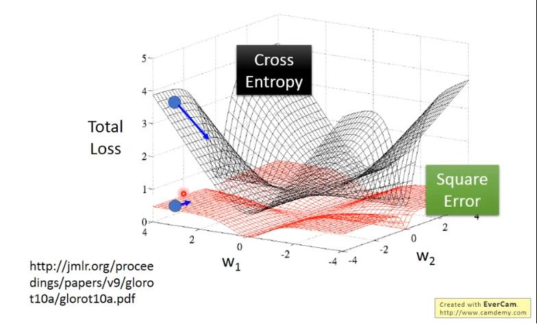

# Machine Learning Course （Li Hongyi 2023)

## 1.ChatGPT Introduction

- ### Possible Method ：

Pre-Train 预训练  => Self-Supervised  自督导式学习 => Supervised learning 督导式学习 => Intensive training 强化训练

- ### Foreground: 

Prompting 工程，Neural Editing , AI 检测，Machine Unlearning


------


## 2.Regression

> [ML讲座1：回归 - 案例研究 - YouTube](https://www.youtube.com/watch?v=fegAeph9UaA)

### 2.1 Three Steps

#### Step1 Linear Model

$$
y = b+\omega*x_{cp} => y = b+\sum{w_i*x_i}
$$

$$
x_i:feature,w_i:weight,b:bias
$$


#### Step2 Goodness of function

Loss Function L 
$$
L(f)= L(\omega,b)
$$
Normal 
$$
L(f)=\sum^{10}_{n=1}{(\hat{y}^n-(b+\omega*x^n_{cp}))^2}
$$

#### Step3 Gradient Descent 

- #### For one parameter


$$
\omega^*=argmin_\omega{L(\omega)}
$$

1.pick initial value $\omega^0$

2.$\omega^1 \leftarrow \omega^0-\eta*\frac{dL}{d\omega}|_{\omega=\omega^0}$ 

3.$\omega^2 \leftarrow \omega^1-\eta*\frac{dL}{d\omega}|_{\omega=\omega^1}$

.... => Local optimal (not global)

- #### For two parameters


1.$\omega^1 \leftarrow \omega^0-\eta*\frac{dL}{d\omega}|_{\omega=\omega^0,b=b^0}$  

$b^1 \leftarrow b^0-\eta*\frac{dL}{db}|_{\omega=\omega^0,b=b^0}$

2.$\omega^2 \leftarrow \omega^1-\eta*\frac{dL}{d\omega}|_{\omega=\omega^1,b=b^1}$  

$b^2 \leftarrow b^1-\eta*\frac{dL}{db}|_{\omega=\omega^1,b=b^1}$

......

### 2.2 For Many Types

- #### back to design model


$$
y=b_1*\delta(x_s=pidgey)+\omega_1*\delta(x_s=pidgey)*x_{cp}+....+b_4*\delta(x_s=Eevee)+\omega_4*\delta(x_s=Eevee)
$$

$$
\delta=\begin{cases}
1, &x_s=type\\
0, &x_s\neq type
\end{cases}
$$

- #### Regularization


$$
L=\sum_n{(\hat{y}-(b+\sum{\omega_ix_i})})^2+\lambda\sum{w_i^2}
$$

$\lambda$越大，找到的越平滑


------


## 3.Classification

> [ML Lecture 4: Classification - YouTube](https://www.youtube.com/watch?v=fZAZUYEeIMg)

$$
x\rightarrow Function \rightarrow ClassN
$$

### 3.1 Ideal Alternatives

- #### Function(Model)


$$
x \Rightarrow \begin{cases}
g(x) >0|Output=class1\\
else|Output=class2
\end{cases}
$$

- #### Loss Function


$$
L(f)=\sum_n{\delta(f(x^n)\neq\hat{y}^n)}
$$

Number of times f get incorrect results on training data.

- #### Find best fusnction


Perceptron,SVM


### 3.2 Generative Model(Gaussian Distribution)

$$
f_{\mu,\sum(x)}=\frac{1}{(2\pi)^{D/2}}\frac{1}{|\sum|^{1/2}}exp\lbrace\frac{-1}{2}(x-\mu)^T*{\sum}^{-1}(x-\mu)\rbrace
$$

Determined by Mean $\mu$ ,convariance matrix $\sum$

- #### Maximum Likelihood


$$
L(\mu,\sum)=f_{\mu,\sum}(x^1)*f_{\mu,\sum}(x^2).....f_{\mu,\sum}(x^79)
$$

$$
\Rightarrow(\mu^*,{\sum}^*)=argMax_{\mu,\sum}L(\mu,\sum)
$$

$$
\mu^*=\frac{1}{79}\sum^{79}_{n=1}x^n\\
{\sum}^*=\frac{1}{79}\sum_{n=1}^{79}(x^n-\mu^*)(x^n-\mu^*)^T
$$

- #### Back To Classification


$$
P(C_1|x)>0.5\Rightarrow x\in Class1
$$
从多维空间来看增加更多参数容易导致overfitting 

### 3.3 Resolution

给两边分类相同的$\sum$ 
$$
L(\mu_1,\mu_2,\sum)=f_{\mu_1,\sum}(x^1)*f_{\mu_1,\sum}(x^2).....f_{\mu_1,\sum}(x^{79})f_{\mu_2,\sum}(x^{80})...f_{\mu_2,\sum}(x^{140})
$$

$$
\Rightarrow\mu_1=\mu_2\\
\Rightarrow\sum=\frac{79}{140}{\sum}^1+\frac{61}{140}{\sum}^2
$$


### 3.4 Three Steps

- #### Function Set(Model)


$$
x\Rightarrow P(C_1|x)=\frac{P(x|C_1)*P(C_1)}{P(x|C_1)*P(C_1)+P(x|C_2)*P(C_2)}\Rightarrow\begin{cases}P(C_1|x)>0.5\rightarrow class1\\P(C_1|x)<0.5\rightarrow class2\end{cases}
$$

- #### Goodness of a function


​					mean $\mu$ ,convariance $\sum$ Maximizing the likelihood

- #### Transformation


If $\sum_1=\sum_2=\sum$
$$
z=(\mu^1-\mu^2)^T{\sum}^{-1}x-\frac{1}{2}(\mu^1)^T({\sum}^1)^{-1}\mu^1+\frac{1}{2}(\mu^2)^T({\sum}^1)^{-1}\mu^2+\ln\frac{N1}{N2}
$$

$$
z=w^Tx-b
$$

$$
\Rightarrow P(C_1|x)=\sigma(w*x+b)
$$

------

## 4.Logistic Regression

> https://www.youtube.com/watch?v=hSXFuypLukA&feature=youtu.be

### 4.1 Comparison with Linear Regression

#### Step1 Function

- ##### For Logistic Regression


$$
f_{w,b}(x)=\sigma(\sum_iw_ix_i+b)
$$

Output: between 0 and 1

- ##### For Linear Regression


$$
f_{w,b}(x)=\sum_iw_ix_i+b
$$

Output: any value

#### Step2 Goodness of a Function

Training Data : 


$$
L(w,b)=f_{w,b}(x^1)f_{w,b}(x^2)(1-f_{w,b}(x^3))...f_{w,b}(x^N)
$$
The most likely $w^*$ and $b^*$ is the one with the largest $L(w,b)$
$$
w^*,b^*=arg\max_{w,b}L(w,b)
$$

$$
\Rightarrow w^*,b^*=arg\max_{w,b}-\ln L(w,b)
$$

$$
-lnf_{w,b}(x^1)\Rightarrow-[\hat{y}^1lnf(x^1)+(1-\hat{y}^1ln(1-f(x^1))]\\
-lnf_{w,b}(x^2)\Rightarrow-[\hat{y}^2lnf(x^2)+(1-\hat{y}^2ln(1-f(x^2))]\\
-lnf_{w,b}(x^3)\Rightarrow-[\hat{y}^3lnf(x^3)+(1-\hat{y}^3ln(1-f(x^3))]\\
....
$$

$$
\Rightarrow -lnL(w,b)=\sum_n{-[\hat{y}^nlnf_{w,b}(x^n)+(1-\hat{y}^nln(1-f_{w,b}(x^n))]}
$$

Cross entropy between two Bernoulli distribution


- ##### For Logistic Regression


$\hat{y}^n$:1 for class 1, 0 for class 2
$$
L(f)=\sum_nC(f(x^n),\hat{y}^n)
$$

- ##### For Linear Regression


$$
L(f)=\frac{1}{2}\sum_n(f(x^n)-\hat{y}^n)^2
$$

#### Step3 Find the best function


- ##### For Logistic Regression and  LInear Regression


The same
$$
w_i\leftarrow w_i-\eta\sum_n{-(\hat{y}^n-f_{w,b}(x^n))x_i^n}
$$

### 4.2 If Use Logistic Regression with square error



用Square error 离目标很远时趋势也很小,导致update很慢.

### 4.3 Discriminative(Logistic Regression) vs Generative Model

#### Generative Model

 做了假设 数据来源于某种分布 故适合于训练量少的情况

With the assumption of probability distribution, less training data is needed

With the assumption of probability distribution, more robust to the noise

Priors and class-dependent probabilities can be estimated from different sources

#### Discriminative 

没有做任何假设  

### 4.4 Multi-class Classification


### 4.5 Limitation of Logistic Regression

Boundary 为一根直线

#### Feature Transformation (resolution)

Not alaways easy to find a good transformation

##### Use to cascade logistic regression models


Every Logistic regression called "Neuron" ,Get Neural Network 神经网络

------

## 5.Brief Introduction of Deep Learning

> [ML Lecture 6: Brief Introduction of Deep Learning - YouTube](https://www.youtube.com/watch?v=Dr-WRlEFefw)

### 5.1 Fully Connect Feedforwrad Netwrok


> Deep = Many hidden layers

#### Converted to matrix operation


> Use GPU accelerate matrix operations

### 5.2 Loss Function


Total Loss: 
$$
L=\sum_{n=1}^N{C^n}
$$
Then find a function( network parameter $\theta$ ) in function set that minimizes total loss L

### 5.3 Gradient Descent (to find the best $\theta$)


------

## 6.Introduction of Deep Learning

> [【機器學習2021】預測本頻道觀看人數 (上) - 機器學習基本概念簡介 - YouTube](https://www.youtube.com/watch?v=Ye018rCVvOo)
>
> https://www.youtube.com/watch?v=bHcJCp2Fyxs&feature=youtu.be

### 6.1 Type of Machine Learning

* Regression
* Classification
* Structured Learning

### 6.2 Choose more flexible Model 

#### 	Model

​		运用Sigmoid Function 逼近 Precewise Linear Curve , 再用多个Precewise Linear Curve 组合为分段函数，分段函数再分的足够多情况下逼近任何函数
$$
y=b+wx_1\\ \Rightarrow
y= b+ \sum_ic_isigmoid(b_i+w_ix_1)
$$

$$
y=b+\sum_jw_jx_j\\ \Rightarrow
y= b+ \sum_ic_isigmoid(b_i+\sum_jw_{ij}x_j)
$$


Image 25:37

#### Loss function

#### Optimization


### 6.3 Sigmoid $\rightarrow$ Rectified Linear Unit (ReLU)

$$
y=b+\sum_{2i}c_imax(0,b_i+\sum_jw_{ij}x_j)
$$

All called  **Activation Function**

### 6.4  Deep Learning (Neural Network)

​	Use many layers of activation function.

------


## HW1. Regression

### Objectives

* Solve a regression problem with deep neural networks (DNN).
* Understand basic DNN training tips.
* Familiarize yourself with PyTorch.

### DataSet

```python
class COVID19Dataset(Dataset):
    '''
    x: Features.
    y: Targets, if none, do prediction.
    '''
    def __init__(self, x, y=None):
        if y is None:
            self.y = y
        else:
            self.y = torch.FloatTensor(y)
        self.x = torch.FloatTensor(x)

    def __getitem__(self, idx):
        if self.y is None:
            return self.x[idx]
        else:
            return self.x[idx], self.y[idx]

    def __len__(self):
```

```python
class My_Model(nn.Module):
    def __init__(self, input_dim):
        super(My_Model, self).__init__()
        # TODO: modify model's structure, be aware of dimensions. 
        self.layers = nn.Sequential
            nn.Linear(input_dim, 16),
            nn.ReLU(),
            nn.Linear(16, 8),
            nn.ReLU(),
            nn.Linear(8, 1)
        )

    def forward(self, x):
        x = self.layers(x)
        x = x.squeeze(1) # (B, 1) -> (B)
        return x
```

​       


 
